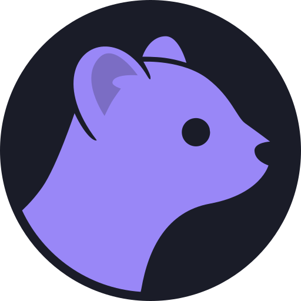

#  Sable Next

A from-scratch rewrite of [Sable](https://github.com/SableClient/Sable), with Svelte and Rust.

Join the Matrix space at [#sable:sable.moe](https://matrix.to/#/#sable:sable.moe) to discuss the project and meowing.

The development web build is deployed to [next.sable.moe](https://next.sable.moe/).
See [`infra/README.md`](infra/README.md) for the Cloudflare Worker and OpenTofu
setup.

## Getting started

[mise](https://mise.jdx.dev) manages Node, pnpm, Rust, and other tooling.

```bash
mise install
mise run setup    # pnpm install + git pre-commit hook
mise run dev      # SvelteKit on http://localhost:3000
```

`mise run dev` builds the development WASM bundle first. While editing Rust in
another terminal, run `mise run wasm:watch`; Vite reloads after each regenerated
bundle. Production builds generate the optimised WASM bundle automatically.

Run `mise tasks` for the full list.

## Apps (Tauri)

Native builds use [Tauri](https://v2.tauri.app). Targets: **Windows**, **macOS**, **Linux**, **Android**, and **iOS**.

```bash
mise run tauri:setup          # Shared Rust/system dependencies, including Linux packages
mise run tauri:icons          # Regenerate native icons after changing the logo SVG
mise run tauri dev            # Run the app for the current desktop OS
mise run tauri:setup:windows  # Windows: Visual Studio Build Tools + WebView2
mise run tauri:setup:macos    # macOS: Xcode
mise run tauri:setup:android  # Android: SDK packages + NDK
mise run tauri:setup:ios      # iOS: Xcode project + CocoaPods (macOS)
```

Every push to `main` publishes bundles for all five targets to the rolling
[`nightly` release](https://github.com/SableClient/sable-next/releases/tag/nightly),
with build attestations. Tagged releases are not set up yet.

## Android (Obtainium)

APKs ship with every build, and [Obtainium](https://obtainium.imranr.dev) updates them straight from GitHub. Each build also publishes an `obtainium.json` app config.

<a href="https://apps.obtainium.imranr.dev/redirect?r=obtainium://app/%7B%22id%22%3A%22moe.sable.next%22%2C%22url%22%3A%22https%3A%2F%2Fgithub.com%2FSableClient%2Fsable-next%22%2C%22author%22%3A%22SableClient%22%2C%22name%22%3A%22Sable%20Next%22%2C%22preferredApkIndex%22%3A0%2C%22additionalSettings%22%3A%22%7B%5C%22about%5C%22%3A%5C%22The%20next%20Sable%20Matrix%20client%5C%22%2C%5C%22includePrereleases%5C%22%3Atrue%2C%5C%22useLatestAssetDateAsReleaseDate%5C%22%3Atrue%2C%5C%22releaseDateAsVersion%5C%22%3Atrue%2C%5C%22versionDetection%5C%22%3Afalse%7D%22%2C%22overrideSource%22%3A%22GitHub%22%7D"></a>
&nbsp;
<a href="https://github.com/SableClient/sable-next/releases/download/nightly/obtainium.json"></a>
&nbsp;
<a href="https://github.com/SableClient/sable-next/releases/tag/nightly"></a>

### Setup & install

1. Install [Obtainium](https://github.com/ImranR98/Obtainium/releases/latest).
2. Tap **Add to Obtainium** above. It opens an import prompt carrying the prerelease and version-tracking settings the rolling `nightly` tag needs.
3. Or download `obtainium.json` and import it with **Import/Export → Import from file**.

## iOS (AltStore / SideStore)

iOS builds are unsigned IPAs distributed through [AltStore](https://altstore.io) and [SideStore](https://sidestore.io). Each build publishes the IPA alongside an `altstore-source.json` manifest, which lists one version because the IPA it replaces is deleted.

<a href="https://intradeus.github.io/http-protocol-redirector?r=altstore://source?url=https://github.com/SableClient/sable-next/releases/download/nightly/altstore-source.json"></a>
&nbsp;
<a href="https://intradeus.github.io/http-protocol-redirector?r=sidestore://source?url=https://github.com/SableClient/sable-next/releases/download/nightly/altstore-source.json"></a>
&nbsp;
<a href="https://github.com/SableClient/sable-next/releases/download/nightly/altstore-source.json"></a>

### Setup & install

1. Set up [AltStore Classic](https://faq.altstore.io/altstore-classic/altserver) or [SideStore](https://docs.sidestore.io) on your device.
2. Tap a button above, or add the source manually:
   - AltStore: `altstore://source?url=https://github.com/SableClient/sable-next/releases/download/nightly/altstore-source.json`
   - SideStore: `sidestore://source?url=https://github.com/SableClient/sable-next/releases/download/nightly/altstore-source.json`
3. Install Sable Next from the source. AltStore/SideStore re-sign the unsigned IPA with your personal development certificate at install time, so apps refresh every 7 days on a free account.

Both configs come from the `obtainium` and `altstore` jobs in [`tauri-build.yml`](.github/workflows/tauri-build.yml).

## Contributing

See [CONTRIBUTING.md](CONTRIBUTING.md).

## License

[AGPL-3.0-only](LICENSE), with an [additional permission](LICENSE) for App Store executables under MPL 2.0. The Sable name and logo are covered by [TRADEMARKS.md](TRADEMARKS.md).
